| SEE ALSO | |
|---|---|
| [`gatte(8)`](https://github.com/bunnyiesart/Gatte) | self-hosted MCP gateway: one authenticated endpoint, per-analyst audit, tool quarantine |
| [`swiss(1)`](https://github.com/bunnyiesart/swiss) | threat intel over MCP: one IOC in, 20+ sources out |
| [`mcp-iris(8)`](https://github.com/bunnyiesart/mcp-iris) | read-only MCP server for DFIR-IRIS |
| [`mcp-opensearch(8)`](https://github.com/bunnyiesart/mcp-opensearch) | read-only OpenSearch / SIEM MCP server |
| [`bluearmory(7)`](https://github.com/bunnyiesart/bluearmory) | blue team MCP collection and Claude Code skills |
| [`auto-treat(1)`](https://github.com/bunnyiesart/auto-treat) | automated SOC triage on DFIR-IRIS |
| [`fursec(7)`](https://bunnyiesart.github.io/Fursec/) | trilha gratuita de cibersegurança: ~200 cursos, PT-BR e EN |
| [`portfolio(1)`](https://bunnyiesart.github.io/portifolio/) | the other website |

<picture>
  <source media="(prefers-color-scheme: dark)" srcset="https://raw.githubusercontent.com/bunnyiesart/bunnyiesart/output/snake-dark.svg"/>
  <source media="(prefers-color-scheme: light)" srcset="https://raw.githubusercontent.com/bunnyiesart/bunnyiesart/output/snake.svg"/>
  
</picture>

