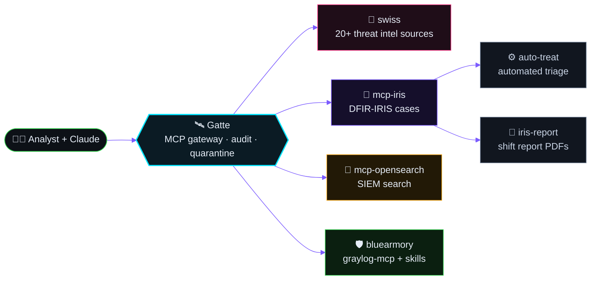
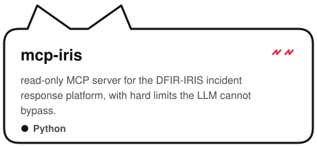
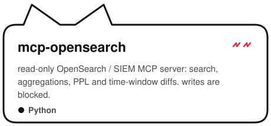
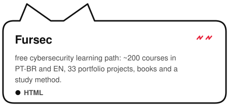

<div align="center">



<a href="https://github.com/bunnyiesart">
  
</a>

<br/>

<a href="https://bunnyiesart.github.io/portifolio/"></a> <a href="https://bunnyiesart.github.io/Fursec/"></a> <a href="https://github.com/bunnyiesart?tab=followers"></a>

</div>

<br/>

## `$ whoami`

```yaml
name:      Gabriel Silva Coelho
role:      Cybersecurity Analyst @ BSDTrust
base:      Brasil 🇧🇷
blue_team: [SOC, DFIR, threat intel, detection engineering]
red_side:  [blackbox pentest, web security]
building:  MCP servers that plug AI into real SOC tooling
into:      [FreeBSD, kernel hardening, self-hosting]
speaks:    [pt-BR, en]
motto:     "Transformando vulnerabilidades em código"
```

<details>
<summary><b>🇧🇷 Versão em português</b></summary>
<br/>

Sou analista de cibersegurança com foco em **Blue Team**: SOC, resposta a incidentes (DFIR), threat intel e engenharia de detecção. Também atuo com **pentest blackbox e web**.
Hoje construo **servidores MCP** que dão a assistentes de IA acesso seguro e auditado às ferramentas do SOC: SIEM, DFIR-IRIS e mais de 20 fontes de inteligência.
Mantenho o **[Fursec](https://bunnyiesart.github.io/Fursec/)**, uma trilha gratuita de cibersegurança com ~200 cursos em PT-BR e EN.

</details>

## 🛰️ The SOC toolkit

> Everything below is built to plug an AI analyst into the real SOC: **read-only by default, audited, and hardened on the server side**.



## 🔥 Featured projects

<div align="center">

<a href="https://github.com/bunnyiesart/Gatte"></a> <a href="https://github.com/bunnyiesart/swiss"></a>
<a href="https://github.com/bunnyiesart/mcp-iris"></a> <a href="https://github.com/bunnyiesart/mcp-opensearch"></a>
<a href="https://github.com/bunnyiesart/bluearmory"></a> <a href="https://bunnyiesart.github.io/Fursec/"></a>

</div>

## 🧰 Arsenal

<div align="center">

**Code & infra**


**Security stack**

           

</div>

## 📡 Telemetry

<div align="center">


<br/><br/>

<picture>
  <source media="(prefers-color-scheme: dark)" srcset="https://raw.githubusercontent.com/bunnyiesart/bunnyiesart/output/snake-dark.svg"/>
  <source media="(prefers-color-scheme: light)" srcset="https://raw.githubusercontent.com/bunnyiesart/bunnyiesart/output/snake.svg"/>
  
</picture>

</div>

<div align="center">

</div>
